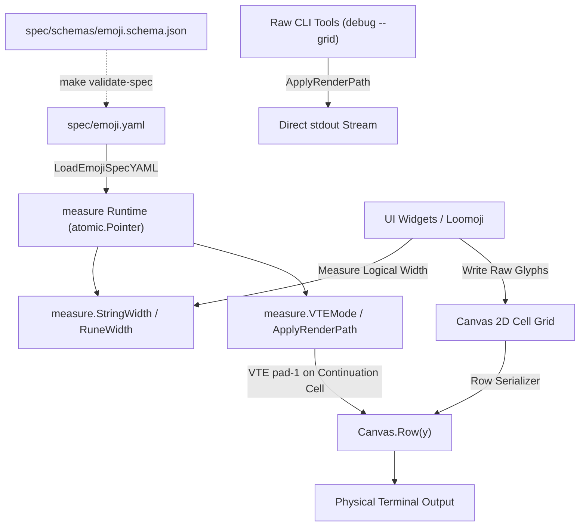

<!-- SPDX-FileCopyrightText: 2026 Uwe Jugel -->
<!-- SPDX-License-Identifier: AGPL-3.0-or-later -->

# Emoji & Unicode Width Measurement

This document records the architecture, invariants, and terminal mitigation strategies for emoji and sequence width measurement in Loom.

---

## 1. Core Principles & Single Source of Truth

Loom treats cell widths and rendering transformations as spec-governed data:
- **Spec Author**: [`spec/emoji.yaml`](../spec/emoji.yaml), validated against JSON schema [`spec/schemas/emoji.schema.json`](../spec/schemas/emoji.schema.json).
- **Core Runtime**: [`measure`](../measure/), specifically [`measure/spec.go`](../measure/spec.go) and [`measure/measure.go`](../measure/measure.go).
- **Invariants**:
  1. **No Shadow Tables**: User applications, examples (e.g. `loomoji`), and internal widgets must never maintain hardcoded emoji width maps or shadow tables in Go source. All width logic and terminal transformation modes must originate from `spec/emoji.yaml` and be accessed via `measure.*`.
  2. **Deterministic Line Widths**: Text layouts, category grids, box borders, and UI bars must have identical, deterministic line lengths across all frames.

---

## 2. Terminal Rendering Discrepancies (VTE & XTerm)

Terminal emulators (particularly VTE-based terminals such as GNOME Terminal, Tilix, Ptyxis, and XTerm derivatives) often diverge from Unicode / POSIX `wcwidth` in how they advance the cursor and render glyphs:

### A. Variation Selector-16 (`\uFE0F`) on Single-Cell Bases
- **Behavior**: For base symbols (e.g. `☠`, `⌨`, `☀️`, `☁`, `⚠️`, `☢️`, `☣️`) followed by `\uFE0F`, VTE advances the cursor by the base glyph's `wcwidth` (1 cell), but the terminal font draws the emoji across 2 cells.
- **Root Cause & Pitfall**: If `pad-1` is applied to string payloads inside widgets (e.g. `ApplyAutoRenderMode("✈️") -> "✈️ "`), `StringWidth` sees 2+1=3 cells, creating phantom canvas cells and desynchronizing the 2D grid from the physical terminal cursor.
- **Architectural Mitigation (Canvas Serializer)**: 
  - Widgets operate purely on logical visual width (2 columns per emoji) using unpadded strings.
  - When [`Canvas.Row(y)`](../canvas.go) serializes cells in `RenderPathVTE`, it inspects lead cells requiring `pad-1` and emits a space `' '` on their continuation cell instead of skipping it.
  - VTE advances 1 column for the glyph + 1 column for the continuation space = 2 columns, keeping the physical cursor in exact lockstep with the 2D canvas grid.

### B. Arrow Ligatures & Font Extensions
- **Behavior**: Long arrows (`⟵`, `⟶`, `⟷`, `⟹`, `⟺`) have East Asian Width Neutral (1 cell in POSIX `wcwidth`), but monospace fonts render wide ligature extensions that clip or drift when rendered in 1 column.
- **Mitigation**: Specced as `width: 2` with `vte_mode: pad-1`.

### C. Multi-part ZWJ Sequences & Overlaps
- **Behavior**: Multi-character sequences with Zero Width Joiner (`\u200D`) like `🐻‍❄️` (Bear + ZWJ + Snowflake + VS16) or `👁️‍🗨️` (Eye + ZWJ + Speech Bubble + VS16) may not be joined into a single ligature by all terminal renderers, rendering as separate consecutive glyphs.
- **Mitigation**: Specced with explicit widths (`4` and `3`) and `vte_mode: pad-1` to maintain visual row alignment.

### D. Naturally Wide VS16 Glyphs
- **Behavior**: Certain glyphs such as `⭐️` (U+2B50 + U+FE0F) advance by 2 cells naturally in VTE fonts.
- **Mitigation**: Specced with explicit override `vte_mode: default` so no unnecessary trailing pad is appended.

---

## 3. Measurement Pipeline Architecture

### Key API Functions (`measure` package)

- `measure.StringWidth(s string) int`: Returns the total visual cell width for string `s`, parsing ANSI escapes, wide runes, combining sequences, and spec overrides.
- `measure.RuneWidth(r rune) int`: Fast-path visual width for a single Unicode rune.
- `measure.VTEMode(glyph string) string`: Looks up the specced VTE render mode (`default`, `pad-1`, `no-vs16`, `no-vs16-pad`, `force-vs16`, `split-zwj`, `base-only`).
- `measure.ApplyRenderMode(glyph string, mode string) string`: Applies a specific render transformation.
- `measure.ApplyVTEMode(glyph string) string`: Applies the specced VTE render mode to `glyph`.
- `measure.ApplyRenderPath(glyph string, path RenderPath) string`: Applies the authoritative transformation for non-canvas raw output streams.

---

## 4. Verification & Testing

1. **Spec Validation**: `make validate-spec` validates `spec/emoji.yaml` against its JSON Schema, including negative control assertions.
2. **Category Width PTY Test**: [`examples/loomoji/loomoji_category_width_pty_test.go`](../examples/loomoji/loomoji_category_width_pty_test.go) executes Loomoji across all categories in a real virtual terminal PTY, asserting that every line has uniform column width without horizontal drift or ragged edges.
3. **PTY Virtual Terminal Emulator**: [`internal/ptytest/vt.go`](../internal/ptytest/vt.go) models VTE single-column cursor advance for `pad-1` glyphs to accurately verify terminal rendering behavior.
4. **Debug Tools**:
   - `loomoji debug --grid -W <w>`: Renders all emojis partitioned by their VTE cell width (1, 2, 3, 4) in a grid to visually inspect column alignment.
   - `loomoji debug --measure`: Interactive TUI tool to measure glyph alignment against terminal cell columns.

## Terminal ZWJ Detection (issue 134)

Terminals disagree on ZWJ sequences: foot and kitty join 👨‍👩‍👧‍👦 into one 2-column glyph; tilix, ptyxis
and alacritty draw the parts separately (8 columns). Regional-indicator flags are 2 columns in all five.

- `Pane.run` calls `measure.DetectZWJMode` after entering raw mode and the screen: it writes a ZWJ
  family, reads the cursor column with `ESC[6n` (200 ms timeout), and erases the probe row.
- Default without an answer is `split`. `LOOM_ZWJ=join|split` overrides detection; PTY tests pin `join`.
- Importing `measure` does no terminal I/O.
- `loom-probe` prints the measured advances for a terminal.
- Recorded `.ansi` frames bake in the recorder's mode (`join`) and are only column-exact in joining
  terminals.
