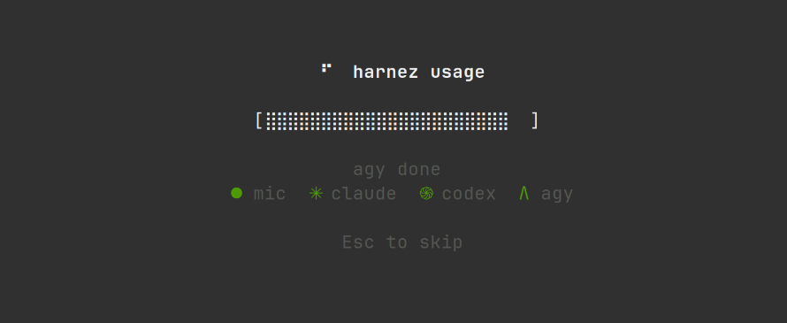

# Harnez Splash UI Target

This document records the startup splash and loading screen target for Loom.
It serves as the reference target for centered flex-layouts, braille activity
animations, determinate progress bars, status pill clusters, and transition
lifecycles.

## Screenshot



## Monochrome reference

In-progress fetch state:

```text
                    ⠙  harnez usage

              [⣿⣿⣿⣿⡇                   ]

                  fetching claude...
               ● mic  ✳ claude  ֍ codex  Λ agy

                      Esc to skip
```

Completed initialization state:

```text
                    ⠛  harnez usage

              [::::::::::::::::::::::::::::::::]

                      agy done
               ● mic  ✳ claude  ֍ codex  Λ agy

                      Esc to skip
```

## UI model implied by the target

The splash screen is a vertically and horizontally centered viewport container
with discrete stateful sub-components:

```text
splash screen
└── centered viewport container (flex column, align center)
    ├── title line
    │   ├── animated spinner / activity glyph (braille sequence)
    │   └── application title ("harnez usage")
    ├── progress / activity bar
    │   ├── left bracket "["
    │   ├── determinate / animated braille fill
    │   └── right bracket "]"
    ├── status line
    │   └── current task / step description (e.g. "fetching claude...", "agy done")
    ├── provider status row (flex row, centered)
    │   └── status pill items (glyph + service name + state color)
    │       ├── mic (●)
    │       ├── claude (✳)
    │       ├── codex (֍)
    │       └── agy (Λ)
    └── footer / dismissal hint
        └── keyboard action hint ("Esc to skip" / "Press Enter to continue")
```

## State & transition lifecycle

The splash screen models an asynchronous initialization pipeline:

```text
Init Start ──► Fetch Providers (parallel/sequential) ──► Complete ──► Transition to Dashboard
     │                    │                                   │
     └────────────────────┴─── [Esc / Keypress] ──────────────┴──────► Immediate Dashboard
```

1. **Spinner & Progress**: The header spinner animates continuously at a fixed
   tick rate while the bar reflects either aggregate loading percentage or an
   activity pulse.
2. **Provider Indicators**: Each service pill transitions through lifecycle
   states:
   - *Pending*: Dim / muted gray
   - *Active / Fetching*: Accent / animated glyph
   - *Ready / Success*: Green symbol
   - *Failed / Skipped*: Warning / error color
3. **Completion & Dismissal**: When all providers finish (or the user presses
   `Esc`), the splash view transitions cleanly to the main dashboard view.

## Planned Loom example

The splash screen example should be part of the Harnez target demo:

```text
examples/harnez-target/
├── go.mod
├── main.go                 # startup state machine and screen switching
├── splash.loom.yaml        # declarative splash layout and styles
├── dashboard.loom.yaml     # main dashboard layout
├── splash_data.go          # provider init simulation and events
└── splash_test.go          # deterministic layout and state rendering tests
```

## Acceptance examples

The Loom splash screen implementation should verify:

1. **Centering**: The splash cluster remains centered both vertically and
   horizontally across changing terminal dimensions.
2. **Braille & Unicode Safety**: Braille glyphs and unicode symbols (`⠙`, `⣿`, `●`,
   `✳`, `֍`, `Λ`) do not cause layout skew or ANSI column calculation bugs.
3. **Width Stability**: Step message updates (e.g. transitioning from `fetching claude...`
   to `agy done`) do not alter the bar width or horizontal center.
4. **Key Dismissal**: Pressing `Esc` immediately triggers the exit / transition
   handler.
5. **Decoupled Animation**: Spinner ticks do not block or lag background
   provider initialization routines.
