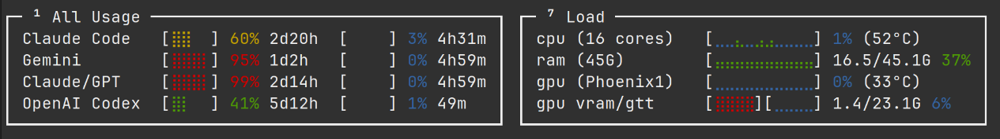
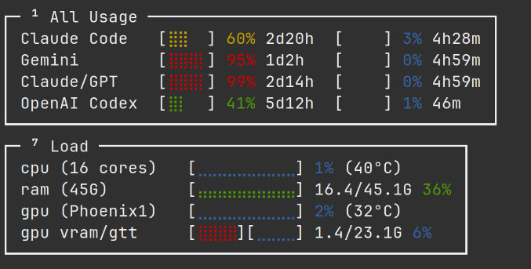
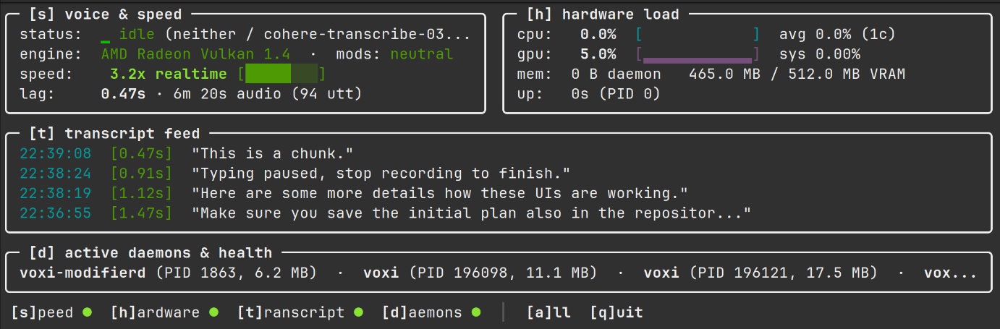

# Harnez Usage UI Target

This document records the real-world UI that Loom should be able to reproduce.
It is the reference target for the box, flex-layout, graph, color, responsive
layout, and live-data work.

## Screenshots

Wide terminal layout:



Slim terminal layout:



The wide layout places the two panels side by side. The slim layout places the
Load panel below All Usage. This should be a layout decision made from the
available width, not two separate UI implementations.

## Monochrome reference

Wide layout:

```text
┌─ ¹ All Usage ───────────────────────────────────┐ ┌─ ⁷ Load ─────────────────────────────────────┐
│ Claude Code   [⣿⣿  ] 60% 2d20h  [    ] 3% 4h29m │ │ cpu (16 cores)   [⣠⣀⣀⣀⣀⣀⣀⣄⣀⣀] 1% (47°C)      │
│ Gemini        [⣿⣿⣿⡇] 95% 1d2h   [    ] 0% 4h59m │ │ ram (45G)        [⣤⣤⣤⣤⣤⣤⣤⣤⣤⣤] 16.4/45.1G 36% │
│ Claude/GPT    [⣿⣿⣿⡇] 99% 2d14h  [    ] 0% 4h59m │ │ gpu (Phoenix1)   [⣀⣀⣀⣀⣀⣀⣀⣀⣀⣀] 0% (34°C)      │
│ OpenAI Codex  [⣿⡇  ] 41% 5d12h  [    ] 1% 47m   │ │ gpu vram/gtt     [⣿⣿⣿⣿][⣀⣀⣀⣀] 1.4/23.1G 6%   │
└─────────────────────────────────────────────────┘ └──────────────────────────────────────────────┘
```

Slim layout:

```text
┌─ ¹ All Usage ───────────────────────────────────┐
│ Claude Code   [⣿⣿  ] 60% 2d20h  [    ] 3% 4h28m │
│ Gemini        [⣿⣿⣿⡇] 95% 1d2h   [    ] 0% 4h59m │
│ Claude/GPT    [⣿⣿⣿⡇] 99% 2d14h  [    ] 0% 4h59m │
│ OpenAI Codex  [⣿⡇  ] 41% 5d12h  [    ] 1% 46m   │
└─────────────────────────────────────────────────┘
┌─ ⁷ Load ─────────────────────────────────────┐
│ cpu (16 cores)   [⣀⣀⣀⣀⣀⣀⣀⣀⣀⣀] 3% (35°C)      │
│ ram (45G)        [⣤⣤⣤⣤⣤⣤⣤⣤⣤⣤] 16.4/45.1G 36% │
│ gpu (Phoenix1)   [⣀⣀⣀⣀⣀⣀⣀⣀⣀⣀] 3% (31°C)      │
│ gpu vram/gtt     [⣿⣿⣿⣿][⣀⣀⣀⣀] 1.5/23.1G 6%   │
└──────────────────────────────────────────────┘
```

## UI model implied by the target

The screen is a declarative tree with live values supplied separately:

```text
dashboard
├── responsive row/column layout
├── box: All Usage
│   └── usage rows
│       ├── label
│       ├── determinate usage bar
│       ├── percentage and duration
│       ├── second determinate bar
│       └── percentage and duration
└── box: Load
    └── load rows
        ├── label
        ├── rolling timeline
        ├── current value
        └── optional temperature / memory details
```

The VRAM/GTT row is a special composite row containing two independent
timelines. It must not be reduced to one aggregate value.

## Data and redraw contract

Collectors and rendering operate in separate time domains:

```text
collectors (CPU/GPU/RAM/network) ──► shared immutable snapshot/history
                                      │
                                      ▼
                               fixed-rate redraw
                                      │
                                      ▼
                                  Loom view
```

The collector may sample at 1 Hz, 20 Hz, or another domain-specific rate. The
Loom renderer redraws at its configured frame rate and only reads the latest
snapshot. A faster redraw must never advance a timeline or cause the collector
to be sampled implicitly.

Harnez issue 259 documents this invariant and its existing implementation. The
Loom port should preserve it rather than putting collection inside `Draw`.

## Existing reusable implementation

Harnez's `internal/rograph` package already provides dependency-free renderers:

- `RenderBar` for determinate bars with configurable glyphs, ranges, colors,
  wrappers, and sub-character precision.
- `PercentSparkline` for absolute-scale rolling percentage timelines.
- `RenderSparkline` for block and Braille presentations.
- Fixed-width and shrink-to-fit behavior.

Relevant source:

- `../harnez/internal/rograph/bar.go`
- `../harnez/internal/rograph/sparkline.go`
- `../harnez/internal/rograph/options.go`
- `../harnez/issues/259-decouple-hardware-load-timeline-sampling-from-high-fps-tui-redraw-cadence.md`
- `../harnez/issues/198-load-box-sparkline-width-and-vram-gtt-split-restoration.md`

Loom should consume this behavior through a small adapter or extracted public
package. The layout and data model belong to Loom; Harnez-specific collection
and metric naming should remain outside it.

`../pync` was checked but is not present in the current workspace. `../voxi`
contains monitoring-related code, but no equivalent graph renderer was found.

## Planned Loom example

The eventual executable example should have this shape:

```text
examples/harnez-target/
├── go.mod
├── main.go                 # collector wiring and fixed-rate redraw loop
├── dashboard.loom.yaml     # declarative boxes, rows, and responsive layout
├── dashboard_data.go       # snapshot/history types and test data
└── dashboard_test.go       # deterministic render and layout tests
```

The YAML should describe the structure and presentation. Go should provide the
changing values, history buffers, and application actions. No collector should
be required to know the terminal coordinates of a widget.

## Acceptance examples

The first Loom target tests should establish these behaviors:

1. At wide width, All Usage and Load occupy one horizontal row.
2. Below the responsive breakpoint, Load moves below All Usage.
3. Both boxes retain borders, titles, and stable inner padding.
4. Usage bars render fixed-width colored fills and empty regions.
5. Load timelines retain a fixed visual width, including on startup with short
   histories.
6. VRAM and GTT render as two independent adjacent timelines.
7. Changing snapshot values changes the next frame without changing layout.
8. Re-rendering the same snapshot does not append history samples.
9. ANSI color changes do not change measured terminal geometry.
10. The rendered monochrome output remains column-stable when values move from
    `99%` to `100%`.

This target is intentionally concrete: it gives Loom a demanding but bounded
integration example for validating that declarative layout, generic boxes,
graph widgets, responsive composition, and disconnected live data work
together.

## Voxi monitor target

The same target family also includes the Voxi monitor. It adds application
chrome around the pane layout:



Reference title/status chrome:

```text
Agentic usage  22:37:34 CEST   history: 1 file (21.9 KB)   5 hidden (press ? for controls)
<panes...>
refresh every 1m0s   [?]controls  [m]ode  [r]emote  [q]uit
```

Reference structure:

```text
monitor
├── title bar
│   ├── application name
│   ├── current time
│   ├── history summary
│   └── hidden-pane/control hint
├── responsive content layout
│   ├── box: voice & speed
│   ├── box: hardware load
│   ├── box: transcript feed
│   └── box: active daemons & health
└── status bar
    ├── pane visibility hints: [s], [h], [t], [d]
    ├── all-panels hint: [a]
    └── quit hint: [q]
```

The Voxi target adds these requirements:

- Box titles may contain a keyboard hint such as `[s]` or a superscript number.
- The bottom status bar repeats the available controls and shows active panes.
- Label/value rows use a stable label column (`status:`, `engine:`, `speed:`).
- Long values are truncated with an ellipsis without changing the box width.
- Both regular and bold text are needed, along with colored status indicators.
- The same UI supports one-shot rendering and `--watch` live updates.
- Monitoring data and redraw cadence remain independent.

Voxi already has useful renderer-level behavior in
`../voxi/internal/monitor/render.go`, especially ANSI-safe visible-width
measurement, truncation, terminal-width caching, and one-shot/watch handling.
Those behaviors should inform Loom's generic text and layout primitives without
bringing Voxi's monitoring domain into Loom.

## Combined porting target

Harnez and Voxi together identify the first serious Loom application boundary:

```text
declarative Loom document
  ├── application chrome and status bar
  ├── responsive boxes and nested rows
  ├── labels, text, values, hints, and truncation rules
  ├── progress bars and rolling timelines
  └── pane visibility / keyboard actions

Go application layer
  ├── collectors and daemon queries
  ├── immutable snapshots and history buffers
  ├── action handlers
  └── fixed-rate redraw scheduler
```

The first implementation should use deterministic fake snapshots in tests.
Live Harnez/Voxi collectors should be connected only after the rendering and
layout contract is stable.
