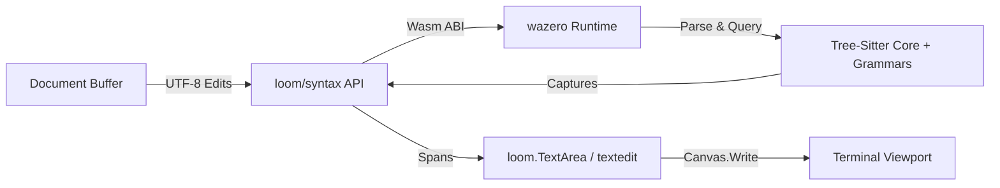

# Study: Pure-Go / Wasm (wazero) Tree-Sitter Syntax Engine for Loom

**Date**: 2026-09-26  
**Status**: In Progress  
**Authors**: Antigravity, luna:med (dev), terra:med (review)  
**Related Tickets**: #118, #119, #120, #121, #122  

---

## 1. Executive Summary & Goal

Loom is developing an AST-driven syntax highlighting and structural navigation engine for terminal text components (`loom.TextArea`, `examples/textedit`).

To preserve Loom's core architectural principle of **zero-CGO, pure-Go cross-compilation**, we are investigating and implementing a WebAssembly-backed Tree-Sitter runtime via [`wazero`](https://github.com/tetratelabs/wazero).

---

## 2. Architectural Decisions & Guardrails

1. **Strict Decoupling (No Cyclic Imports)**:
   - `codeberg.org/ubunatic/loom/syntax` is UI-neutral. It deals strictly with source buffers, `syntax.Edit` structs, byte/rune coordinates, and string capture tokens (`@keyword`, `@string`, `@function`).
   - `loom.TextArea` and theme resolvers map capture strings to `loom.Style` (`FG`, `BG`, `Bold`, etc.) at draw time.

2. **Coordinate Normalization**:
   - Tree-Sitter native: UTF-8 byte offsets and `Point{Row, Column}`.
   - Text buffer: Unicode runes (`[]rune`).
   - Canvas / Terminal: Grapheme clusters & display cell widths (`StringWidth()`).
   - The engine establishes explicit conversion functions with unit test guarantees for multi-byte runes, emojis, and tabs.

3. **Viewport-Bounded Evaluation**:
   - Querying and span emission are bounded to the visible viewport lines (`[scrollY, scrollY + height)`), maintaining $O(\text{viewport})$ rendering overhead.

---

## 3. Milestones & Progress Log

| Milestone | Ticket | Status | Developer | Reviewer | Artifacts |
|---|---|---|---|---|---|
| **M1: Wazero & Grammar Spike** | #118 | Starting | `luna:med` | `terra:med` | `internal/canary/treesitter/` |
| **M2: Core Syntax API** | #119 | Pending | `luna:med` | `terra:med` | `syntax/` |
| **M3: Production Wasm Engine** | #120 | Pending | `luna:med` | `terra:med` | `syntax/engine.go` |
| **M4: TextArea Integration** | #121 | Pending | `luna:med` | `terra:med` | `examples/textedit` |
| **M5: AST Breadcrumbs & Navigation** | #122 | Pending | `luna:med` | `terra:med` | `.ansi` visual reports |

---

## 4. Work Log & Findings
*(Live updates recorded as each milestone progresses)*
