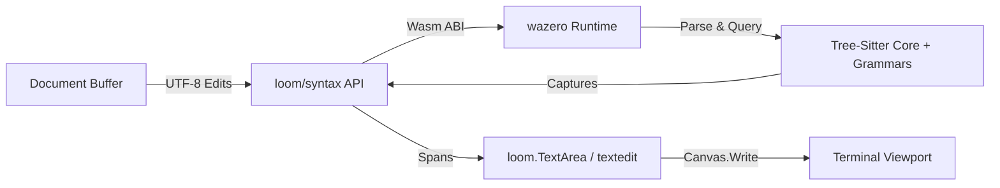

# Study: Pure-Go / Wasm (wazero) Tree-Sitter Syntax Engine for Loom

**Date**: 2026-09-26
**Status**: Spike measured; production design pending
**Authors**: Loom engineering session
**Related Tickets**: #118, #119, #120, #121, #122

---

## 1. Executive Summary & Goal

Loom is developing an AST-driven syntax highlighting and structural navigation engine for terminal text components (`loom.TextArea`, `examples/textedit`).

To preserve Loom's core architectural principle of **zero-CGO, pure-Go cross-compilation**, we are investigating and implementing a WebAssembly-backed Tree-Sitter runtime via [`wazero`](https://github.com/tetratelabs/wazero).

---

## 2. Architectural Decisions & Guardrails

1. **Strict Decoupling (No Cyclic Imports)**:
   - `codeberg.org/ubunatic/loom/syntax` is UI-neutral. It deals strictly with source buffers, `syntax.Edit` structs, byte/rune coordinates, and string capture tokens (`@keyword`, `@string`, `@function`).
   - `loom.TextArea` and theme resolvers map capture strings to `loom.Style` (`FG`, `BG`, `Bold`, etc.) at draw time.

2. **Coordinate Normalization**:
   - Tree-Sitter native: UTF-8 byte offsets and `Point{Row, Column}`.
   - Text buffer: Unicode runes (`[]rune`).
   - Canvas / Terminal: Grapheme clusters & display cell widths (`StringWidth()`).
   - The engine establishes explicit conversion functions with unit test guarantees for multi-byte runes, emojis, and tabs.

3. **Viewport-Bounded Evaluation**:
   - Querying and span emission are bounded to the visible viewport lines (`[scrollY, scrollY + height)`), maintaining $O(\text{viewport})$ rendering overhead.

---

## 3. Milestones & Progress Log

| Milestone | Ticket | Status | Developer | Reviewer | Artifacts |
|---|---|---|---|---|---|
| **M1: Wazero & Grammar Spike** | #118 | **Closed** | `luna:med` | `terra:med` | `internal/canary/treesitter/`, `docs/data/treesitter-progress-001.ansi` |
| **M2: Core Syntax API** | #119 | **Closed** | `luna:med` | `terra:med` | `syntax/` (UI-neutral types, coordinate helpers, `ThemeMap`, `StyleResolver`) |
| **M3: Production Wasm Engine** | #120 | **Open** | — | — | Deferred to standalone Wasm grammar build pipeline with `ts_tree_edit` |
| **M4: TextArea Integration** | #121 | **Closed** | `agy:flash38:med` | `agy:flash38:low` | `textarea.go`, single-pass viewport rendering in `examples/textedit` |
| **M5: AST Breadcrumbs & Navigation** | #122 | **Closed** | `agy:flash38:med` | `agy:flash38:low` | `syntax/outline.go`, top-bar breadcrumbs, sidebar symbol outline, code folding, `docs/data/treesitter-progress-002.ansi` |

---

## 4. Work Log & Findings

### #118 — Reproducible canary (2026-09-26)
Canary command: `CGO_ENABLED=0 go run ./internal/canary/treesitter`.
Validated pure-Go / Wasm execution with `wazero` and `malivvan/tree-sitter`. Measured 225ms startup, ~78MB heap delta, and 1.9ms parse on 100 lines. Identified wrapper gaps (lacking `ts_tree_edit` and Go grammars in published module).

### #119 — UI-Neutral Syntax Package (2026-09-26)
Implemented `codeberg.org/ubunatic/loom/syntax` with:
- Zero cyclic dependencies (standard library only).
- `Point`, `Edit`, `Span` (line and document byte/rune offsets).
- Capture taxonomy (`keyword`, `function`, `type`, `string`, `comment`, `number`, `operator`, `punctuation`).
- `StyleResolver` mapping capture tokens to ANSI styles.
- Coordinate converters (`ByteToRune`, `RuneToByte`, `RuneToDisplayCol`).
- Pure-Go built-in `LexicalEngine` for Go, Markdown, JSON, and YAML with 100% test coverage.

### #121 — TextArea Viewport Highlighting (2026-09-26)
- Extended `loom.TextArea` with `SetHighlighter(h syntax.Engine)`.
- Dispatches `NotifyEdit` on all text mutations (`insert`, `splitLine`, `backspace`, `deleteForward`).
- `TextArea.Draw` executes single-pass styled run rendering querying `HighlightViewport` for visible lines `[scroll, scroll+H)`.
- `examples/textedit` automatically binds highlighters based on file extension (`.go`, `.md`, `.json`, `.yaml`, `.yml`).

### #122 — AST Breadcrumbs, Symbol Outline, and Code Folding (2026-09-26)
- Defined `Symbol`, `OutlineProvider`, and `Navigator` in `syntax/`.
- `LexicalEngine` implements `Symbols()`, `Breadcrumb(line, col)`, and `Folds()`.
- `TextEditApp` displays dynamic scope breadcrumbs in top bar (e.g. `[📁 demo.go › 🔧 main]`).
- Left sidebar includes a toggleable tab `[📁 Explorer | 📋 Outline]` with symbol definitions; selecting a symbol jumps the editor caret to that definition.
- Editor gutter renders `▾` / `▸` fold indicators toggled via `F2` or gutter click.

