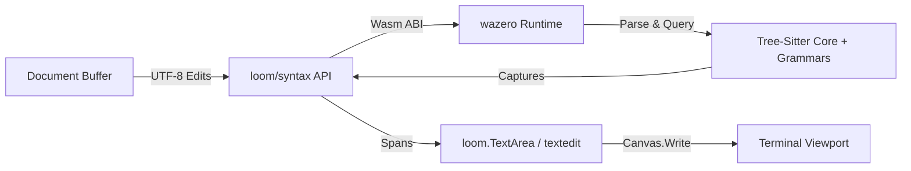

# Study: Pure-Go / Wasm (wazero) Tree-Sitter Syntax Engine for Loom

**Date**: 2026-09-26
**Status**: Spike measured; production design pending
**Authors**: Loom engineering session
**Related Tickets**: #118, #119, #120, #121, #122

---

## 1. Executive Summary & Goal

Loom is developing an AST-driven syntax highlighting and structural navigation engine for terminal text components (`loom.TextArea`, `examples/textedit`).

To preserve Loom's core architectural principle of **zero-CGO, pure-Go cross-compilation**, we are investigating and implementing a WebAssembly-backed Tree-Sitter runtime via [`wazero`](https://github.com/tetratelabs/wazero).

---

## 2. Architectural Decisions & Guardrails

1. **Strict Decoupling (No Cyclic Imports)**:
   - `codeberg.org/ubunatic/loom/syntax` is UI-neutral. It deals strictly with source buffers, `syntax.Edit` structs, byte/rune coordinates, and string capture tokens (`@keyword`, `@string`, `@function`).
   - `loom.TextArea` and theme resolvers map capture strings to `loom.Style` (`FG`, `BG`, `Bold`, etc.) at draw time.

2. **Coordinate Normalization**:
   - Tree-Sitter native: UTF-8 byte offsets and `Point{Row, Column}`.
   - Text buffer: Unicode runes (`[]rune`).
   - Canvas / Terminal: Grapheme clusters & display cell widths (`StringWidth()`).
   - The engine establishes explicit conversion functions with unit test guarantees for multi-byte runes, emojis, and tabs.

3. **Viewport-Bounded Evaluation**:
   - Querying and span emission are bounded to the visible viewport lines (`[scrollY, scrollY + height)`), maintaining $O(\text{viewport})$ rendering overhead.

---

## 3. Milestones & Progress Log

| Milestone | Ticket | Status | Developer | Reviewer | Artifacts |
|---|---|---|---|---|---|
| **M1: Wazero & Grammar Spike** | #118 | Measured with limitations | Loom | — | `internal/canary/treesitter/` |
| **M2: Core Syntax API** | #119 | Pending | `luna:med` | `terra:med` | `syntax/` |
| **M3: Production Wasm Engine** | #120 | Pending | `luna:med` | `terra:med` | `syntax/engine.go` |
| **M4: TextArea Integration** | #121 | Pending | `luna:med` | `terra:med` | `examples/textedit` |
| **M5: AST Breadcrumbs & Navigation** | #122 | Pending | `luna:med` | `terra:med` | `.ansi` visual reports |

---

## 4. Work Log & Findings

### #118 — Reproducible canary (2026-09-26)

Canary command: `CGO_ENABLED=0 go run ./internal/canary/treesitter` from the repository root. It uses `github.com/malivvan/tree-sitter` v0.0.1, which embeds Tree-sitter v0.24.7 as a WASI module and runs it with wazero v1.8.2. This verifies the Go-side engine can build and execute with CGO disabled. On this Linux/amd64 host, one run reported:

| Operation | Input | Latency | Go allocations |
|---|---:|---:|---:|
| Runtime + Wasm module load | embedded core and C/C++ grammar module | 225.7 ms | 78,285,048 B total allocation delta |
| Initial parse | C, 100 lines / 3,280 B | 1.99 ms | 4,016 B during parse |
| Initial parse | C, 1,000 lines / 34,780 B | 18.87 ms | 41,520 B during parse |
| Initial parse | C, 10,000 lines / 367,780 B | 229.87 ms | 79,381,056 B during parse |
| Query execution | `(function_definition) @function` | 100 / 1,000 / 10,000 matches | not separately sampled |
| Reparse after appending one newline | 3,281 / 34,781 / 367,781 B | 1.88 / 23.59 / 304.77 ms | not separately sampled |

These are one-run smoke measurements, not statistical benchmarks; the canary reports wall-clock values and runtime `TotalAlloc`, and does not isolate the runtime's WebAssembly linear memory. Query walking allocates Go node/match wrappers, but its allocations were not included in the parse allocation sample. Re-run several times on target hardware before making a latency decision.

The available binding exports C and C++ grammars in its embedded module, not Go or JSON. It exposes no `ts_tree_edit` / `TSInputEdit` path, so its one-character-change measurement is a full reparse and does not validate incremental reuse. The requested <2 ms interactive incremental target is therefore unproven. The query compiler and execution path do work for the bundled C grammar.

**Assessment:** wazero can execute the bundled Tree-sitter core and grammars without CGO, but this binding is not yet a suitable production substrate for Loom. Its roughly 78 MB startup allocation delta and missing incremental API need investigation; Go/JSON grammar coverage needs a compatible Wasm build. For #119/#120, first build or select a binding that exposes tree edits and can load independently compiled grammar modules, then repeat this benchmark with clean parse-only allocation accounting, actual incremental edits, and repeated samples. Keep grammar/runtime ABI versions pinned together. No CGO-vs-Wasm speed comparison was made.
